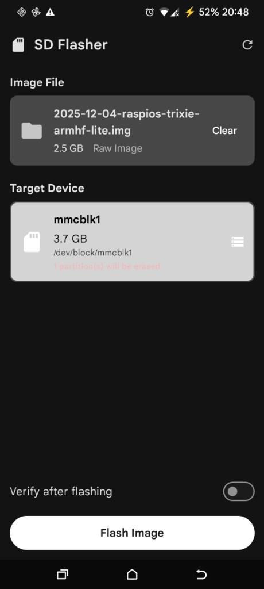
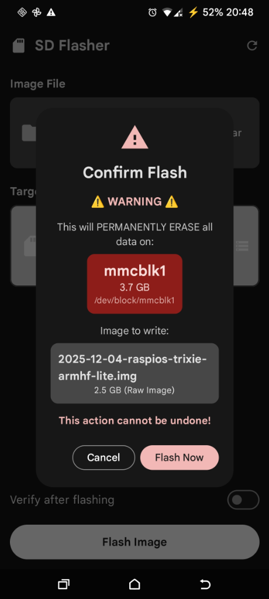
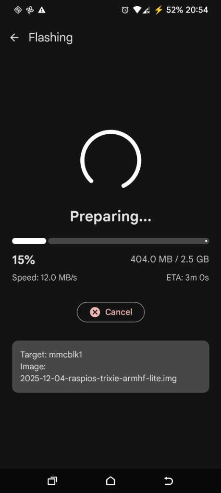

# SD Flasher

<p align="center">
  
  
  
</p>

<p align="center">
  <strong>Flash disk images to SD cards directly from your Android device</strong>
</p>

<p align="center">
  <a href="https://github.com/theblazehen/sd_flasher/releases/latest">
    
  </a>
  <a href="https://github.com/theblazehen/sd_flasher/releases">
    
  </a>
  
  
</p>

---

## Features

- 🚀 **Direct block device writing** - Flash images directly to SD cards at maximum speed
- 📦 **Compressed image support** - Handles `.img`, `.img.gz`, `.img.xz`, and `.zip` files
- 📊 **Real-time progress** - Live speed, ETA, and progress tracking
- ⚡ **Fast writes** - 4MB buffer for optimal performance
- 🛡️ **Safety first** - Confirmation dialogs and partition warnings
- 🎨 **Material You** - Modern UI with dynamic color support

## Requirements

- **Android 7.0+** (API 24)
- **Root access** (Magisk, KernelSU, or similar)
- SD card slot or USB card reader

## Installation

### Download
Download the latest APK from the [Releases](https://github.com/theblazehen/sd_flasher/releases/latest) page.

### Build from source
```bash
git clone https://github.com/theblazehen/sd_flasher.git
cd sd_flasher
./gradlew assembleDebug
```

The APK will be at `app/build/outputs/apk/debug/app-debug.apk`

## Usage

1. **Grant root access** when prompted
2. **Select an image file** using the file picker
3. **Select the target SD card** from the device list
4. **Tap "Flash Image"** and confirm the warning
5. **Wait for completion** - do not remove the SD card!

## Supported Image Formats

| Format | Extension | Notes |
|--------|-----------|-------|
| Raw Image | `.img` | Direct write, fastest |
| GZip Compressed | `.img.gz`, `.gz` | Common for RPi images |
| XZ Compressed | `.img.xz`, `.xz` | High compression ratio |
| ZIP Archive | `.zip` | First `.img` file extracted |

## Safety

> ⚠️ **Warning**: This app writes directly to block devices. Double-check your target device before flashing!

The app includes several safety measures:
- Only removable devices are shown (internal storage is excluded)
- Partition warnings displayed for devices with existing data
- Two-step confirmation before flashing
- Device is unmounted before writing

## Why Root?

Android's security model prevents apps from writing to raw block devices. Root access is required to:
- Access `/dev/block/*` devices
- Unmount mounted partitions
- Write directly to storage hardware

## Tech Stack

- **Kotlin** + **Jetpack Compose** - Modern Android UI
- **libsu 6.0.0** - Root shell and RootService by topjohnwu
- **Apache Commons Compress** - Decompression support
- **Hilt** - Dependency injection
- **Material 3** - Dynamic theming

## Building

### Prerequisites
- Android Studio Hedgehog or newer
- JDK 17
- Android SDK 35

### Debug build
```bash
./gradlew assembleDebug
```

### Release build
```bash
./gradlew assembleRelease
```

## Contributing

Contributions are welcome! Please:

1. Fork the repository
2. Create a feature branch
3. Make your changes
4. Submit a pull request

## License

```
GNU GENERAL PUBLIC LICENSE Version 3, 29 June 2007

Copyright (C) 2025

This program is free software: you can redistribute it and/or modify
it under the terms of the GNU General Public License as published by
the Free Software Foundation, either version 3 of the License, or
(at your option) any later version.

This program is distributed in the hope that it will be useful,
but WITHOUT ANY WARRANTY; without even the implied warranty of
MERCHANTABILITY or FITNESS FOR A PARTICULAR PURPOSE.  See the
GNU General Public License for more details.

You should have received a copy of the GNU General Public License
along with this program.  If not, see <https://www.gnu.org/licenses/>.
```

## Acknowledgments

- [libsu](https://github.com/topjohnwu/libsu) by topjohnwu - Root shell library
- [Apache Commons Compress](https://commons.apache.org/proper/commons-compress/) - Compression support

---

<p align="center">
  Made with ❤️ for the Raspberry Pi and embedded Linux community
</p>
